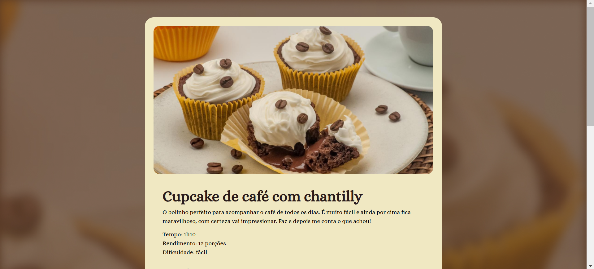

# 🧁 Página de Receita

<p align="center">
  
</p>

Um projeto de uma página web responsiva para exibir uma deliciosa receita de cupcake de café com chantilly, desenvolvido por Dvizioon.

## 🚀 Tecnologias Utilizadas


## 📋 Sobre o Projeto

Este projeto é uma página web responsiva que apresenta uma receita de cupcake de café com chantilly. A página inclui:

- Imagem do produto
- Lista de ingredientes
- Modo de preparo detalhado
- Informações sobre tempo de preparo, rendimento e dificuldade
- Layout responsivo para diferentes dispositivos

## 🎨 Layout

Você pode visualizar o layout do projeto através do link abaixo:

🔗 [Ver Projeto Online](https://dvizioon.github.io/CUPCAKE-RECIPES/)

🔗 [Ver Projeto no Figma](https://www.figma.com/design/XzXw85FjazcCjhvLk50Gdx/P%C3%A1gina-de-receita---RocketSeet?node-id=3-376&t=rXSEHJDvhYCAtXNA-1)

## 💻 Como Executar o Projeto

1. Clone este repositório:
```bash
git clone https://github.com/dvizioon/CUPCAKE-RECIPES.git
```

2. Navegue até a pasta do projeto:
```bash
cd CUPCAKE-RECIPES
```

3. Abra o arquivo `index.html` no seu navegador ou utilize um servidor local.

## 📁 Estrutura do Projeto

```
└── 📁 projeto
   ├── 📁 assets
   │   ├── 📄 heart.svg
   │   └── 📄 main.png
   ├── 📁 css
   │   └── 📄 style.css
   └── 📄 index.html
```

## 🤝 Contribuições

Contribuições são sempre bem-vindas! Se você tem alguma sugestão ou correção, sinta-se à vontade para abrir uma issue ou enviar um pull request.

## ✍️ Autor

Feito com ❤️ por [Dvizioon](https://github.com/dvizioon)

## 📝 Licença

Este projeto está sob a licença MIT. Veja o arquivo [LICENSE](LICENSE) para mais detalhes.